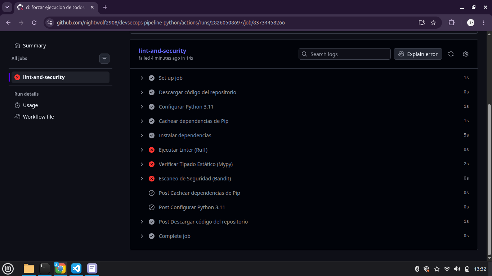

# DevSecOps Pipeline: Análisis Estático y Linters Avanzados en Python

Este proyecto implementa un flujo de trabajo automatizado de Integración Continua (CI) enfocado en la calidad de código, tipado estricto y seguridad estática (SAST). El objetivo es actuar como un revisor implacable ("Gatekeeper") antes de permitir cualquier integración o despliegue.

## 🛠️ Herramientas Utilizadas y Justificación

* **Ruff:** Linter y formateador ultra rápido (escrito en Rust) que obliga al cumplimiento estricto del estándar **PEP 8** y elimina código muerto.
* **Mypy:** Verificador de tipado estático configurado en su modo más estricto (`strict = true`) para prevenir errores de lógica en tiempo de ejecución.
* **Bandit:** Herramienta de seguridad SAST encargada de escanear el árbol de sintaxis abstracta (AST) en busca de vulnerabilidades comunes (OWASP), como credenciales expuestas (Hardcoded Secrets).
* **GitHub Actions:** Orquestador de la infraestructura como código que ejecuta el pipeline en la nube en cada `push` o `pull_request`.

---

## 🚀 Demostración del Comportamiento del Pipeline

Para demostrar la madurez de la arquitectura del pipeline, se introdujeron intencionalmente malas prácticas de ingeniería en el código (`src/main.py`), forzando al pipeline a ejecutar un reporte completo gracias a la directiva `if: always()` instalada en el workflow.

### Reporte de Bloqueo Unificado:
El pipeline interceptó y bloqueó con éxito los siguientes fallos:
1. **Ruff:** Detectó variables declaradas sin usar y líneas que excedían el límite permitido.
2. **Mypy:** Rechazó funciones sin anotaciones explícitas de tipos genéricos (`dict[str, Any]`).
3. **Bandit:** Levantó una alerta de **Severidad Alta** por la presencia de un token de autenticación expuesto directamente en el código.

## 📦 Configuración del Proyecto Local

Si deseas replicar o probar las herramientas de manera local:

1.Clonar el repositorio.
2.Crear e iniciar el entorno virtual:
    python -m venv venv
    source venv/bin/activate 
3.Instalar dependencias de desarrollo:
    pip install -r requirements.txt
4.Ejecutar inspeccion manualmente:
    python -m ruff check src/
    python -m mypy src/
    python -m bandit -r src/